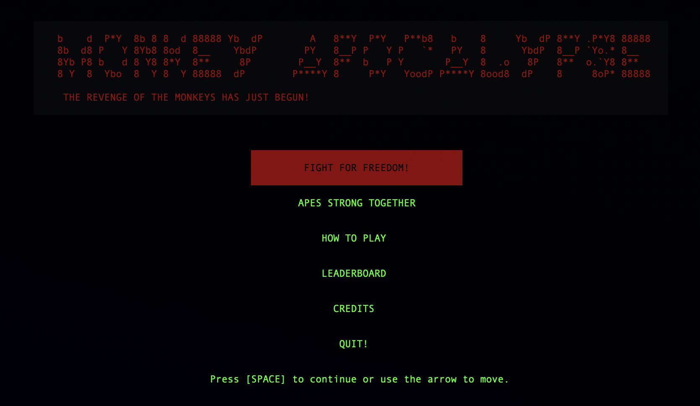
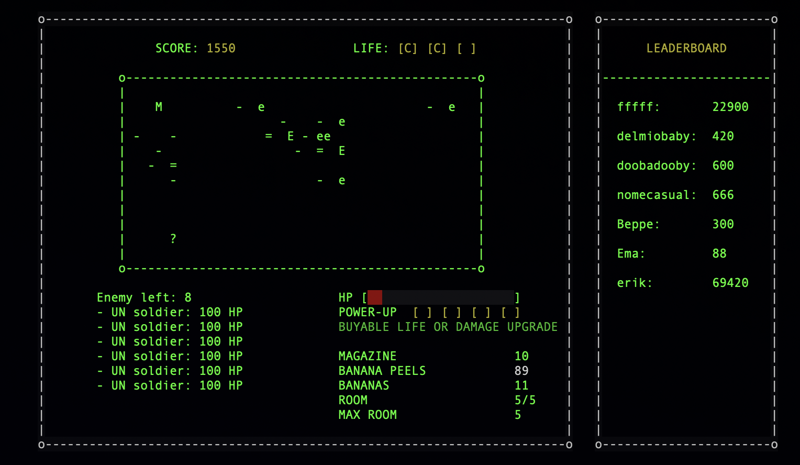

## Programming project A.A. 2020/2021 Unibo
---

 ### Library:
 - ncurses.h

---

### Usage:

- `make`       compile

- `make launch`   launch the game
  
- `make clean`  delete compiled file

- `make cleanscores`   erase leaderBoard
---

 
 <table style="width:100%">
  <tr>
    <td></td>
    <td></td>
  </tr>
</table>
 

